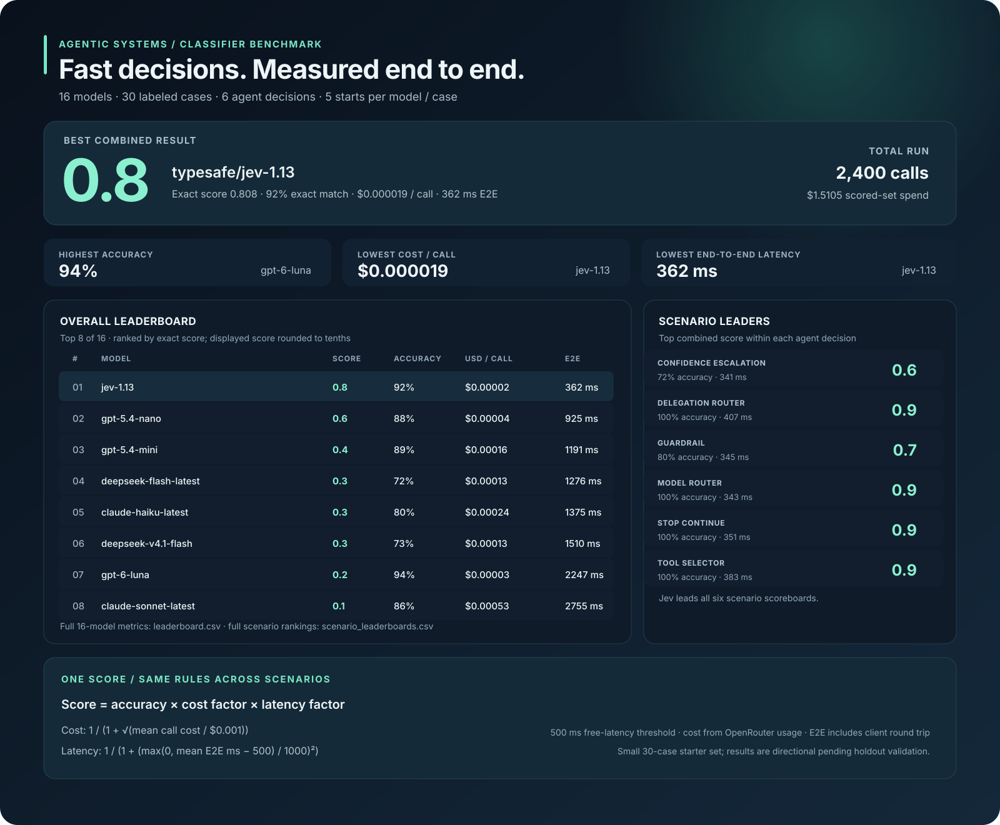
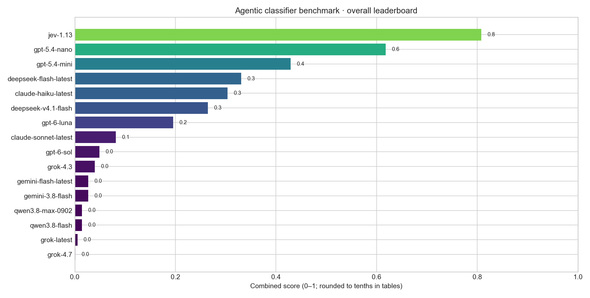
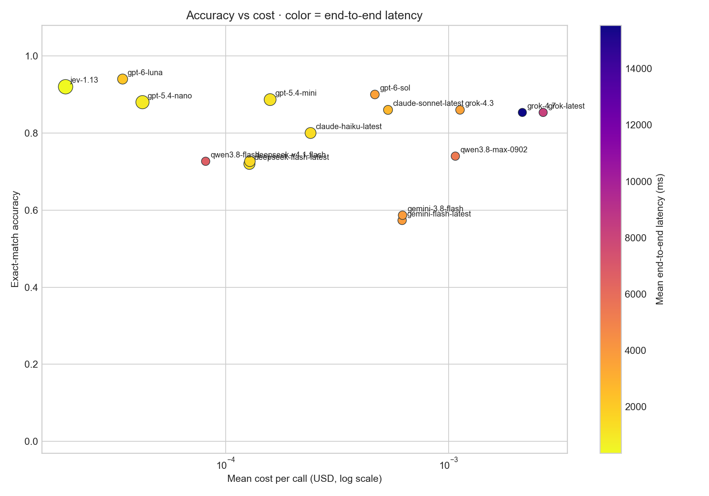
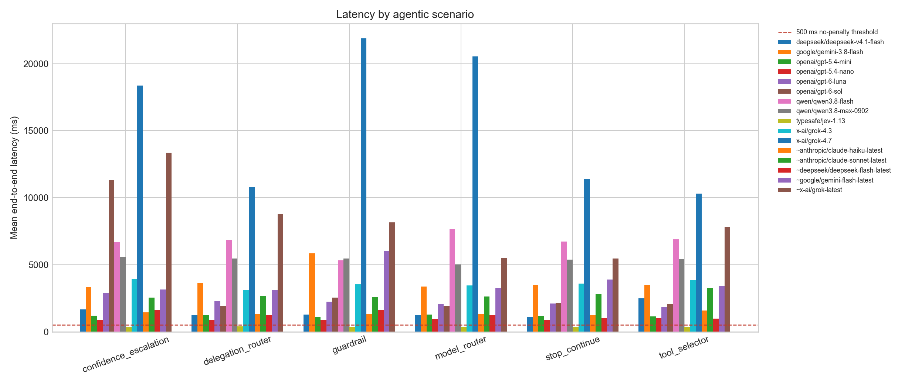

> Historical Python-run output from the earlier Classifier Benchmark. Not generated by the Evolving Benchmark Rust CLI.

# Agentic Loop Classifier Benchmark

> **The short version**  
> **Jev leads the combined score at 0.8/1.0** (exact score **0.808**), with **92% accuracy**, **$0.000019 per call**, and **362 ms** mean end-to-end latency.

## At a glance

| Run | Models | Labeled cases | Starts per model/case | Scored calls | Scored-set cost |
|---|---:|---:|---:|---:|---:|
| Agentic Loop classifier benchmark | 16 | 30 | 5 | 2,400 | $1.5105 |

| What led | Model | Result |
|---|---|---:|
| Combined score | `typesafe/jev-1.13` | **0.8** (exact 0.808) |
| Exact-match accuracy | `openai/gpt-6-luna` | **94%** |
| Lowest cost per call | `typesafe/jev-1.13` | **$0.000019** |
| Lowest end-to-end latency | `typesafe/jev-1.13` | **362 ms** |

The ranked set cost **$1.5105**. An additional 150 Haiku calls used to correct a parser issue cost **$0.0361**; diagnostic requests are excluded.

## What the results say

- **Jev is the strongest practical balance in this run.** It reached 92% accuracy versus 94% for GPT-6 Luna, the accuracy leader. Jev was 6.2× faster and 1.8× cheaper per call. Its exact combined score was 0.808 versus 0.196.
- **GPT-6 Luna maximized accuracy, but latency reduced its combined score.** Its 94% exact match is the best quality result in this set; Jev wins when cost and end-to-end response time are included.
- **GPT-6 Low scored 90% accuracy.** Its 3645 ms mean latency and $0.000467 call cost produce an exact score of 0.049, displayed as 0.0 at the requested one-decimal precision.
- **Gemini Flash underperformed on this compact structured-output set.** The rolling alias reached 57% accuracy and 60% parseable output; pinned Gemini 3.8 reached 59% and 62%. The rolling alias resolved to both 3.7 and 3.8 during the run, while the pinned result was also weak.
- **Haiku's first result was a parser artifact.** After accepting JSON wrapped in Markdown fences, accuracy was 80% and parseable output was 100%; strict raw JSON compliance was 0%. Consumers should either accept the wrapper or enforce native structured output.

## Overall leaderboard

Scores are ranked using the unrounded value. The first score column is rounded to tenths for presentation; exact values are included because several models round to 0.0.

| Rank | Requested model | Resolved model version(s) | Score (display / exact) | Accuracy | Parseable | Strict JSON¹ | Mean cost/call | Mean E2E (ms) |
|---:|---|---|---:|---:|---:|---:|---:|---:|
| 1 | `typesafe/jev-1.13` | `typesafe/jev-1.13-20260917` | 0.8 / 0.808 | 92% | 100% | n/a | $0.000019 | 362 |
| 2 | `openai/gpt-5.4-nano` | `openai/gpt-5.4-nano` | 0.6 / 0.618 | 88% | 100% | 100% | $0.000042 | 925 |
| 3 | `openai/gpt-5.4-mini` | `openai/gpt-5.4-mini` | 0.4 / 0.429 | 89% | 100% | 100% | $0.000158 | 1191 |
| 4 | `~deepseek/deepseek-flash-latest` | `deepseek/deepseek-v4.1-flash` | 0.3 / 0.331 | 72% | 83% | 83% | $0.000128 | 1276 |
| 5 | `~anthropic/claude-haiku-latest` | `anthropic/claude-haiku-4.5` | 0.3 / 0.304 | 80% | 100% | 0% | $0.000240 | 1375 |
| 6 | `deepseek/deepseek-v4.1-flash` | `deepseek/deepseek-v4.1-flash` | 0.3 / 0.265 | 73% | 83% | 83% | $0.000129 | 1510 |
| 7 | `openai/gpt-6-luna` | `openai/gpt-6-luna` | 0.2 / 0.196 | 94% | 99% | 99% | $0.000035 | 2247 |
| 8 | `~anthropic/claude-sonnet-latest` | `anthropic/claude-sonnet-5` | 0.1 / 0.082 | 86% | 100% | 100% | $0.000535 | 2755 |
| 9 | `openai/gpt-6-sol` | `openai/gpt-6-sol` | 0.0 / 0.049 | 90% | 100% | 100% | $0.000467 | 3645 |
| 10 | `x-ai/grok-4.3` | `x-ai/grok-4.3` | 0.0 / 0.040 | 86% | 100% | 100% | $0.001125 | 3582 |
| 11 | `~google/gemini-flash-latest` | `google/gemini-3.7-flash, google/gemini-3.8-flash` | 0.0 / 0.027 | 57% | 60% | 60% | $0.000619 | 3814 |
| 12 | `google/gemini-3.8-flash` | `google/gemini-3.8-flash` | 0.0 / 0.027 | 59% | 62% | 62% | $0.000622 | 3857 |
| 13 | `qwen/qwen3.8-max-0902` | `qwen/qwen3.8-max-0902` | 0.0 / 0.015 | 74% | 78% | 78% | $0.001072 | 5386 |
| 14 | `qwen/qwen3.8-flash` | `qwen/qwen3.8-flash` | 0.0 / 0.014 | 73% | 75% | 75% | $0.000081 | 6689 |
| 15 | `~x-ai/grok-latest` | `x-ai/grok-4.6, x-ai/grok-4.7` | 0.0 / 0.005 | 85% | 100% | 100% | $0.002655 | 8190 |
| 16 | `x-ai/grok-4.7` | `x-ai/grok-4.7` | 0.0 / 0.002 | 85% | 100% | 100% | $0.002142 | 15543 |

## Scenario leaders

| Agent decision | Leader | Score (display / exact) | Accuracy | Mean cost/call | Mean E2E |
|---|---|---:|---:|---:|---:|
| `confidence_escalation` | `typesafe/jev-1.13` | 0.6 / 0.634 | 72% | $0.000018 | 341 ms |
| `delegation_router` | `typesafe/jev-1.13` | 0.9 / 0.874 | 100% | $0.000021 | 407 ms |
| `guardrail` | `typesafe/jev-1.13` | 0.7 / 0.703 | 80% | $0.000019 | 345 ms |
| `model_router` | `typesafe/jev-1.13` | 0.9 / 0.878 | 100% | $0.000019 | 343 ms |
| `stop_continue` | `typesafe/jev-1.13` | 0.9 / 0.879 | 100% | $0.000019 | 351 ms |
| `tool_selector` | `typesafe/jev-1.13` | 0.9 / 0.880 | 100% | $0.000019 | 383 ms |

## Top three by scenario

| Scenario | Rank | Model | Score (display / exact) | Accuracy | Cost/call | Mean E2E |
|---|---:|---|---:|---:|---:|---:|
| `confidence_escalation` | 1 | `typesafe/jev-1.13` | 0.6 / 0.634 | 72% | $0.000018 | 341 ms |
| `confidence_escalation` | 2 | `openai/gpt-5.4-nano` | 0.5 / 0.541 | 76% | $0.000043 | 904 ms |
| `confidence_escalation` | 3 | `openai/gpt-5.4-mini` | 0.4 / 0.384 | 80% | $0.000163 | 1197 ms |
| `delegation_router` | 1 | `typesafe/jev-1.13` | 0.9 / 0.874 | 100% | $0.000021 | 407 ms |
| `delegation_router` | 2 | `openai/gpt-5.4-nano` | 0.7 / 0.680 | 96% | $0.000046 | 904 ms |
| `delegation_router` | 3 | `openai/gpt-5.4-mini` | 0.5 / 0.459 | 100% | $0.000172 | 1235 ms |
| `guardrail` | 1 | `typesafe/jev-1.13` | 0.7 / 0.703 | 80% | $0.000019 | 345 ms |
| `guardrail` | 2 | `openai/gpt-5.4-nano` | 0.4 / 0.404 | 56% | $0.000039 | 896 ms |
| `guardrail` | 3 | `openai/gpt-5.4-mini` | 0.3 / 0.320 | 60% | $0.000146 | 1098 ms |
| `model_router` | 1 | `typesafe/jev-1.13` | 0.9 / 0.878 | 100% | $0.000019 | 343 ms |
| `model_router` | 2 | `openai/gpt-5.4-nano` | 0.7 / 0.692 | 100% | $0.000043 | 944 ms |
| `model_router` | 3 | `~deepseek/deepseek-flash-latest` | 0.4 / 0.442 | 92% | $0.000119 | 1240 ms |
| `stop_continue` | 1 | `typesafe/jev-1.13` | 0.9 / 0.879 | 100% | $0.000019 | 351 ms |
| `stop_continue` | 2 | `openai/gpt-5.4-nano` | 0.7 / 0.717 | 100% | $0.000042 | 898 ms |
| `stop_continue` | 3 | `deepseek/deepseek-v4.1-flash` | 0.5 / 0.502 | 96% | $0.000140 | 1126 ms |
| `tool_selector` | 1 | `typesafe/jev-1.13` | 0.9 / 0.880 | 100% | $0.000019 | 383 ms |
| `tool_selector` | 2 | `openai/gpt-5.4-nano` | 0.7 / 0.663 | 100% | $0.000042 | 1002 ms |
| `tool_selector` | 3 | `~deepseek/deepseek-flash-latest` | 0.6 / 0.611 | 100% | $0.000113 | 974 ms |

## Visual comparison



### Combined score



### Accuracy, cost, and latency



### End-to-end latency by scenario



## Scoring and methodology

The same score formula is applied to every scenario:

```text
cost_factor = 1 / (1 + sqrt(mean_call_cost / $0.001))
latency_factor = 1 / (1 + (max(0, mean_e2e_ms - 500) / 1000)^2)
score = exact_match_accuracy × cost_factor × latency_factor
display_score = round(score, 1)
```

Accuracy, cost, and latency are averaged across five starts within each case, then cases are weighted equally. Cost comes from OpenRouter usage. End-to-end latency includes the client network round trip. All models used the same main-run harness at concurrency 8, except the 150 Haiku replacement calls, which ran sequentially under the provider's RPM limit; Haiku latency is therefore not fully comparable.

## Coverage and caveats

- The set contains 30 labeled cases across 6 scenarios (confidence_escalation: 5; delegation_router: 5; guardrail: 5; model_router: 5; stop_continue: 5; tool_selector: 5). Every model/case pair has five starts.
- Mean standard deviation of accuracy across starts: 8.2%. See `repeat_accuracy_sd` in `leaderboard.csv` for model-level values.
- This is a small initial benchmark. Treat differences as directional until the set is expanded, labels are independently reviewed, and results are checked against a hidden holdout set.
- Markdown-fenced JSON is parsed for exact-match scoring and counted as parseable, but not as strict JSON. Chat models used provider-native JSON mode. Jev used the native typed-choice API; strict JSON does not apply (¹).
- Rolling aliases remain separate from pinned snapshots even when they resolve to the same version. The Gemini Flash rolling alias resolved to both Gemini 3.7 Flash and 3.8 Flash; Grok Latest resolved to 4.6 and 4.7.
- Provider latency and prices vary with time and routing. For publication-quality replication, record the date, requested/resolved IDs, provider route, region, and call parameters.
- Jev was called through OpenRouter Decisions API (`/api/alpha/decisions`); text models used Chat Completions. This compares end-to-end product paths, not isolated model decoding speed.

## Data files

- [Full model leaderboard](leaderboard.csv)
- [Scenario-by-model leaderboard](scenario_leaderboards.csv)
- [Full raw scored responses](../results.jsonl)
- [Benchmark definition and scenarios](../README.md)
